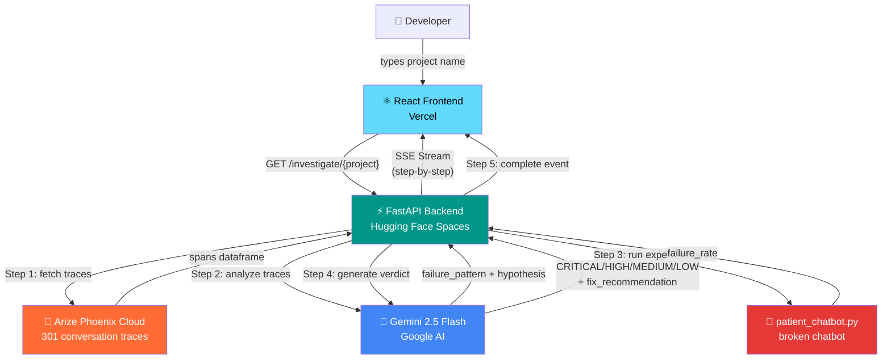
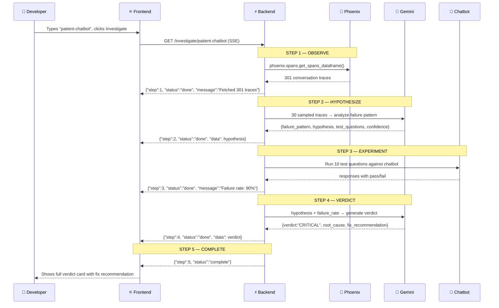
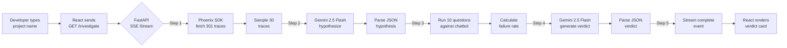
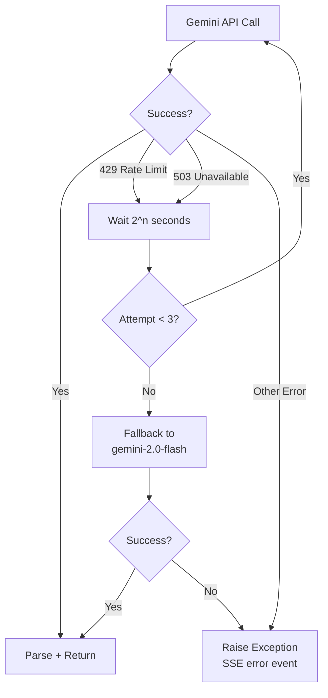

# 🛡️ Sentinel — Autonomous AI Quality Engineer

<div align="center">


[](https://python.org)
[](https://fastapi.tiangolo.com)
[](https://reactjs.org)
[](https://ai.google.dev)
[](https://phoenix.arize.com)
[](https://docker.com)
[](https://huggingface.co/spaces)
[](https://vercel.com)
[](LICENSE)
[](https://googlecloud.devpost.com)

**Sentinel autonomously debugs AI chatbots — finds failure patterns, runs experiments, and delivers a verdict with fix recommendations in under 2 minutes.**

[🚀 Live Demo](https://sentinel-frontend-alpha.vercel.app) · [📺 Demo Video](https://youtu.be/e0d2TOkfOh0) · [🐛 Report Bug](https://github.com/bonamukkala-bot/sentinel-agent/issues) · [💡 Request Feature](https://github.com/bonamukkala-bot/sentinel-agent/issues)

</div>

---

## 📋 Table of Contents

- [Overview](#-overview)
- [The Problem It Solves](#-the-problem-it-solves)
- [Features](#-features)
- [Architecture](#-architecture)
- [The 5-Step Pipeline](#-the-5-step-pipeline)
- [Folder Structure](#-folder-structure)
- [Technology Stack](#-technology-stack)
- [Installation](#-installation)
- [Environment Variables](#-environment-variables)
- [Running Locally](#-running-locally)
- [API Documentation](#-api-documentation)
- [Frontend Architecture](#-frontend-architecture)
- [Backend Architecture](#-backend-architecture)
- [Data Flow](#-data-flow)
- [Deployment Guide](#-deployment-guide)
- [Security](#-security)
- [Performance & Reliability](#-performance--reliability)
- [Troubleshooting](#-troubleshooting)
- [Contributing](#-contributing)
- [Project Roadmap](#-project-roadmap)
- [Learning Resources](#-learning-resources)
- [FAQ](#-faq)
- [License](#-license)
- [Author](#-author)

---

## 🌟 Overview

> **Think of Sentinel as a detective for broken AI systems.**

When an AI chatbot misbehaves in production, a developer today has to:
1. Manually read hundreds of conversation logs
2. Guess what the failure pattern might be
3. Write test cases to verify the guess
4. Figure out the root cause
5. Write a fix recommendation

**That process takes hours. Sentinel does it in 2 minutes — fully autonomously.**

Sentinel connects to your AI observability platform (Arize Phoenix), pulls real conversation traces, uses Gemini 2.5 Flash to identify failure patterns, experimentally validates its hypothesis by running live tests, and returns a structured CRITICAL/HIGH/MEDIUM/LOW verdict with a fix recommendation — all streamed live to a React frontend.

---

## 🔥 The Problem It Solves

```
❌ Before Sentinel:
Developer → reads 300 logs manually → guesses failure pattern →
writes tests → measures failure rate → writes report
⏱️ Time: 2-4 hours

✅ After Sentinel:
Developer → types project name → clicks Investigate →
watches live pipeline → reads verdict
⏱️ Time: 2 minutes
```

**Real-world use cases:**
- QA teams monitoring deployed chatbots
- Developers debugging AI assistants in production
- ML engineers validating LLM behavior at scale
- Companies that need automated AI quality reports

---

## ✨ Features

| Feature | Description |
|---|---|
| 🤖 **Fully Autonomous** | Zero human input after clicking Investigate |
| 🔬 **Experimental Validation** | Doesn't just theorize — actually tests the hypothesis live |
| 📡 **Live SSE Streaming** | Watch each step light up in real time |
| 🎯 **Structured Verdicts** | CRITICAL / HIGH / MEDIUM / LOW with root cause + fix |
| 🔄 **Retry Logic** | Handles Gemini 429/503 with auto-fallback to gemini-2.0-flash |
| ⚠️ **Confidence Badge** | Low confidence warning shown to developer on Step 2 |
| 🏥 **Health Endpoint** | `/health` checks both API keys live on every request |
| 🐳 **Dockerized** | One-command backend deployment |
| ⚡ **Timeout Guards** | asyncio.wait_for prevents hung pipelines |

---

## 🏗️ Architecture



---

## 🔬 The 5-Step Pipeline



### Step Details

| Step | Name | What Happens | Key Output |
|---|---|---|---|
| 1 | **OBSERVE** | Connects to Arize Phoenix, fetches all conversation traces | 301 traces as dataframe |
| 2 | **HYPOTHESIZE** | Sends 30 sampled traces to Gemini, gets structured JSON hypothesis | `failure_pattern`, `hypothesis`, `confidence` |
| 3 | **EXPERIMENT** | Runs 10 targeted questions against the broken chatbot, measures failure rate | `failure_rate: 90-100%` |
| 4 | **VERDICT** | Sends hypothesis + failure rate back to Gemini, gets structured verdict | `CRITICAL` verdict + `fix_recommendation` |
| 5 | **COMPLETE** | SSE stream sends complete event, frontend renders full report | Investigation report |

---

## 📁 Folder Structure

```
sentinel-agent/
│
├── 📁 backend/                    ← Core backend logic (pushed to GitHub)
│   ├── 🐍 sentinel.py             ← 5-step investigation engine (MAIN BRAIN)
│   ├── 🐍 api.py                  ← FastAPI SSE streaming server
│   ├── 🐍 patient_chatbot.py      ← Intentionally broken chatbot (test target)
│   ├── 🐳 Dockerfile              ← Container config for HF Spaces
│   └── 📄 requirements.txt        ← Python dependencies
│
├── 📁 src/                        ← React frontend source
│   ├── 📁 components/             ← UI components
│   └── 🟨 App.js                  ← Main React app (step cards, verdict card)
│
├── 📁 public/                     ← Static assets
├── 📄 package.json                ← Node.js dependencies
├── 📄 README.md                   ← This file
└── 📄 LICENSE                     ← MIT License
```

### File-by-File Explanation

#### `backend/sentinel.py` — The Investigation Engine
The brain of Sentinel. Contains the entire 5-step autonomous pipeline:
- `observe()` — connects to Phoenix, fetches traces using `phoenix.spans.get_spans_dataframe()`
- `hypothesize()` — samples 30 traces, sends to Gemini, parses structured JSON response
- `experiment()` — generates 10 test questions (5 guaranteed triggers + 5 Gemini-generated), runs them against the chatbot, measures failure rate
- `verdict()` — combines hypothesis + failure rate, asks Gemini for final structured verdict
- `gemini_generate()` — custom retry wrapper: retries on 429/503, falls back to `gemini-2.0-flash`

#### `backend/api.py` — The Streaming Server
FastAPI server that exposes the investigation as a Server-Sent Events (SSE) stream:
- `GET /investigate/{project_name}` — starts investigation, streams each step as JSON event
- `GET /health` — live health check, verifies both `GEMINI_API_KEY` and `PHOENIX_API_KEY`
- Uses `asyncio.to_thread` to run blocking Gemini calls without blocking the event loop
- Uses `asyncio.wait_for` with timeouts (120s for experiment, 180s for verdict)

#### `backend/patient_chatbot.py` — The Broken Chatbot
An intentionally broken e-commerce chatbot with 3 failure patterns:
1. **Multi-topic confusion** — asks about return policy AND shipping → fails
2. **Followup ignored** — "What about X?" without context → fails
3. **Hallucination** — asks about discounts/subscriptions that don't exist → makes things up

This is what Sentinel investigates and diagnoses.

#### `src/App.js` — The React Frontend
Live investigation dashboard:
- Step cards that light up one by one as SSE events arrive
- Confidence badge on Step 2 (warns developer if confidence is low)
- Verdict card with color-coded severity (red=CRITICAL, orange=HIGH, yellow=MEDIUM, green=LOW)
- Fix recommendation panel
- "Powered by Gemini 2.5 Flash + Arize Phoenix" footer

---

## 🛠️ Technology Stack

### Why Each Technology Was Chosen

| Technology | Version | Why We Chose It | Alternative |
|---|---|---|---|
| **Gemini 2.5 Flash** | Latest | Fastest Gemini model, structured JSON output, `thinking_budget=0` for speed | GPT-4o, Claude 3.5 |
| **Arize Phoenix** | Cloud | Best-in-class LLM observability, native span/trace storage, Python SDK | LangSmith, W&B |
| **FastAPI** | 0.110+ | Native async support, perfect for SSE streaming, auto-generated docs | Flask, Django |
| **React** | 18 | Component-based UI, real-time state updates for SSE events | Vue, Svelte |
| **Server-Sent Events** | — | One-way server→client streaming, simpler than WebSockets for this use case | WebSockets, polling |
| **Docker** | — | Reproducible environment, required for HF Spaces deployment | Bare metal, venv |
| **Hugging Face Spaces** | — | Free Docker hosting, persistent URL, easy secret management | Railway, Render |
| **Vercel** | — | Auto-deploy from GitHub, zero config for React, free tier | Netlify, Cloudflare Pages |
| **asyncio** | Python 3.11 | Non-blocking I/O for concurrent Gemini calls + SSE streaming | threading, multiprocessing |

### Full Dependency List

```
# AI / LLM
google-genai==1.16.0          # Gemini 2.5 Flash SDK

# Observability
arize-phoenix-client          # Phoenix Cloud SDK for fetching traces

# Backend
fastapi                       # Web framework
uvicorn                       # ASGI server
python-dotenv                 # Environment variable loading
httpx                         # Async HTTP client

# Frontend
react@18                      # UI framework
react-dom@18                  # DOM rendering
```

---

## 🚀 Installation

### Prerequisites

Make sure you have these installed:

```bash
# Check Python version (need 3.11+)
python --version

# Check Node.js version (need 16+)
node --version

# Check npm version
npm --version

# Check Docker (optional, for containerized backend)
docker --version
```

### Clone the Repository

```bash
git clone https://github.com/bonamukkala-bot/sentinel-agent.git
cd sentinel-agent
```

---

## 🔐 Environment Variables

Create a `.env` file in the `backend/` folder:

```env
# Get from: https://aistudio.google.com/app/apikey
GEMINI_API_KEY=your_gemini_api_key_here

# Get from: https://app.phoenix.arize.com → Settings → API Keys
PHOENIX_API_KEY=your_phoenix_api_key_here

# Your Phoenix space name (shown in your Phoenix URL)
PHOENIX_SPACE=your_space_name_here
```

> ⚠️ **Never commit your `.env` file.** It's already in `.gitignore`.

---

## 💻 Running Locally

### Backend Setup

```bash
# Navigate to backend folder
cd backend

# Create virtual environment
python -m venv venv

# Activate it (Windows)
venv\Scripts\activate

# Activate it (Mac/Linux)
source venv/bin/activate

# Install dependencies
pip install -r requirements.txt

# Run the backend server
uvicorn api:app --reload --port 8000
```

Backend will be running at: `http://localhost:8000`

### Frontend Setup

```bash
# Navigate to project root (where package.json is)
cd sentinel-agent

# Install Node dependencies
npm install

# Start React development server
npm start
```

Frontend will be running at: `http://localhost:3000`

> 📝 Make sure to update the API base URL in `App.js` to point to `http://localhost:8000` for local development.

### Test the Pipeline

```bash
# Test health endpoint
curl http://localhost:8000/health

# Test investigation (streams SSE events)
curl http://localhost:8000/investigate/patient-chatbot
```

---

## 📡 API Documentation

### Base URL

| Environment | URL |
|---|---|
| Production | `https://charan-reddy222-sentinel-backend.hf.space` |
| Local | `http://localhost:8000` |

### Endpoints

#### `GET /health`

Checks if the server and both API keys are working.

**Response (200 OK):**
```json
{
  "status": "healthy",
  "gemini_key": "configured",
  "phoenix_key": "configured",
  "timestamp": "2026-06-11T10:30:00Z"
}
```

**Response (500 — missing key):**
```json
{
  "status": "unhealthy",
  "error": "GEMINI_API_KEY not configured"
}
```

---

#### `GET /investigate/{project_name}`

Starts an autonomous investigation. Returns a **Server-Sent Events (SSE) stream**.

**Parameters:**

| Parameter | Type | Required | Description |
|---|---|---|---|
| `project_name` | string | ✅ | Name of the Phoenix project to investigate |

**SSE Event Format:**
```
data: {"step": 1, "status": "running", "message": "Fetching traces from Phoenix..."}

data: {"step": 1, "status": "done", "message": "Fetched 301 traces"}

data: {"step": 2, "status": "running", "message": "Analyzing failure patterns..."}

data: {"step": 2, "status": "done", "data": {
  "failure_pattern": "Multi-topic confusion",
  "hypothesis": "Chatbot fails when user asks about multiple topics in one message",
  "confidence": 0.85,
  "test_questions": ["What is your return policy and shipping time?", ...]
}}

data: {"step": 3, "status": "done", "message": "Experiments complete. Failure rate: 90%"}

data: {"step": 4, "status": "done", "data": {
  "verdict": "CRITICAL",
  "summary": "Chatbot fails 90% of the time on multi-topic queries",
  "root_cause": "No intent disambiguation logic",
  "fix_recommendation": "Add multi-intent detection before routing to response handler",
  "estimated_impact": "~40% of user sessions affected",
  "next_steps": ["Implement intent classifier", "Add clarification prompts"]
}}

data: {"step": 5, "status": "complete", "message": "Investigation complete"}
```

**How to consume SSE in JavaScript:**
```javascript
const eventSource = new EventSource(
  `https://charan-reddy222-sentinel-backend.hf.space/investigate/patient-chatbot`
);

eventSource.onmessage = (event) => {
  const data = JSON.parse(event.data);
  console.log(`Step ${data.step}: ${data.status}`, data);
  
  if (data.status === 'complete') {
    eventSource.close();
  }
};
```

---

## ⚛️ Frontend Architecture

### Component Structure

```
App.js
├── Header (project title + description)
├── InputForm (project name input + Investigate button)
├── StepCards (5 cards, light up as SSE events arrive)
│   ├── StepCard 1 — OBSERVE (traces count)
│   ├── StepCard 2 — HYPOTHESIZE (failure pattern + confidence badge)
│   ├── StepCard 3 — EXPERIMENT (failure rate %)
│   ├── StepCard 4 — VERDICT (severity card)
│   └── StepCard 5 — COMPLETE (powered by footer)
└── VerdictCard (CRITICAL/HIGH/MEDIUM/LOW + fix recommendation)
```

### State Management

```javascript
// Key state variables in App.js
const [steps, setSteps] = useState([]);        // array of step results
const [verdict, setVerdict] = useState(null);  // final verdict object
const [loading, setLoading] = useState(false); // investigation in progress
const [error, setError] = useState(null);      // error message
```

### SSE Connection Logic

```javascript
const investigate = (projectName) => {
  setLoading(true);
  const url = `${BACKEND_URL}/investigate/${projectName}`;
  const eventSource = new EventSource(url);
  
  eventSource.onmessage = (e) => {
    const data = JSON.parse(e.data);
    setSteps(prev => [...prev, data]);
    
    if (data.step === 4 && data.data) setVerdict(data.data);
    if (data.status === 'complete') {
      setLoading(false);
      eventSource.close();
    }
  };
  
  eventSource.onerror = () => {
    setError('Connection lost. Please retry.');
    setLoading(false);
    eventSource.close();
  };
};
```

---

## ⚙️ Backend Architecture

### Key Engineering Decisions

#### 1. Async + SSE Streaming
```python
# api.py — SSE generator
async def stream_investigation(project_name: str):
    async def generate():
        yield f"data: {json.dumps({'step':1,'status':'running'})}\n\n"
        
        # Run blocking Phoenix call in thread pool
        traces = await asyncio.wait_for(
            asyncio.to_thread(observe, project_name),
            timeout=60.0
        )
        yield f"data: {json.dumps({'step':1,'status':'done',...})}\n\n"
        # ... continue for each step
    
    return StreamingResponse(generate(), media_type="text/event-stream")
```

#### 2. Gemini Retry Wrapper
```python
# sentinel.py — handles rate limits gracefully
def gemini_generate(prompt, model="gemini-2.5-flash"):
    for attempt in range(3):
        try:
            response = client.models.generate_content(
                model=model,
                contents=prompt,
                config={"thinking_config": {"thinking_budget": 0}}
            )
            return response.text
        except Exception as e:
            if "429" in str(e) or "503" in str(e):
                time.sleep(2 ** attempt)  # exponential backoff
                if attempt == 2:
                    # Fallback to faster model
                    return gemini_generate(prompt, "gemini-2.0-flash")
            raise
```

#### 3. Structured JSON Extraction
```python
# Extract clean JSON from Gemini response
def parse_json_response(text):
    # Strip markdown code fences if present
    clean = text.replace("```json", "").replace("```", "").strip()
    return json.loads(clean)
```

---

## 🔄 Data Flow



---

## 🚢 Deployment Guide

### Backend — Hugging Face Spaces (Docker)

1. Create a new Space at [huggingface.co/spaces](https://huggingface.co/spaces)
2. Select **Docker** as the SDK
3. Add secrets in Space Settings:
   ```
   GEMINI_API_KEY = your_key
   PHOENIX_API_KEY = your_key
   ```
4. Push your backend code to the Space repo:
   ```bash
   git remote add hf https://huggingface.co/spaces/YOUR_USERNAME/YOUR_SPACE
   git push hf main
   ```

**Dockerfile explained:**
```dockerfile
FROM python:3.11-slim          # Lightweight Python base

WORKDIR /app
COPY requirements.txt .
RUN pip install -r requirements.txt   # Install dependencies

COPY . .

# HF Spaces requires port 7860
EXPOSE 7860
CMD ["uvicorn", "api:app", "--host", "0.0.0.0", "--port", "7860"]
```

### Frontend — Vercel

1. Push frontend code to GitHub (already done ✅)
2. Go to [vercel.com](https://vercel.com) → Import Repository
3. Select `sentinel-agent` repo
4. Add environment variable:
   ```
   REACT_APP_BACKEND_URL = https://your-hf-space.hf.space
   ```
5. Click Deploy — Vercel auto-deploys on every `git push`

---

## 🔒 Security

| Measure | Implementation |
|---|---|
| **API Keys** | Stored as environment variables / HF Secrets, never in code |
| **`.gitignore`** | `.env` file excluded from all commits |
| **CORS** | Configured in FastAPI to allow only the Vercel frontend origin |
| **Input Validation** | `project_name` parameter validated before passing to Phoenix SDK |
| **No User Data Storage** | Stateless by design — no database, no user data persisted |

### ⚠️ Potential Vulnerabilities to Address

- Rate limiting on `/investigate` endpoint (currently unlimited)
- Authentication layer for production use (currently open API)
- Input sanitization for `project_name` to prevent injection

---

## ⚡ Performance & Reliability

### Timeout Configuration

| Step | Timeout | Reason |
|---|---|---|
| Observe (Phoenix) | 60s | Network call to cloud |
| Hypothesize (Gemini) | 90s | LLM generation |
| Experiment (chatbot) | 120s | 10 sequential API calls |
| Verdict (Gemini) | 180s | Complex structured output |

### Failure Handling



### Stateless Design
Sentinel is **deliberately stateless** — each investigation is independent with no shared state. This means:
- ✅ Perfectly reproducible results
- ✅ No database needed
- ✅ Easy horizontal scaling
- ❌ No investigation history (by design for this version)

---

## 🐛 Troubleshooting

### Common Issues

| Issue | Cause | Fix |
|---|---|---|
| `GEMINI_API_KEY not configured` | Missing env var | Add key to `.env` or HF Secrets |
| `No traces found` | Wrong project name | Check project name in Phoenix dashboard |
| `SSE connection drops` | HF Spaces cold start | Wait 30s, retry — Space was sleeping |
| `429 Too Many Requests` | Gemini rate limit | Built-in retry handles this automatically |
| `JSON parse error` | Gemini response wrapped in markdown | Fixed in `parse_json_response()` |
| Frontend shows no steps | CORS error | Check `REACT_APP_BACKEND_URL` in Vercel env vars |

### Debug Tips

```bash
# Check backend health
curl https://charan-reddy222-sentinel-backend.hf.space/health

# Test SSE stream manually
curl -N https://charan-reddy222-sentinel-backend.hf.space/investigate/patient-chatbot

# Check Phoenix traces exist
python -c "
import phoenix as px
client = px.Client()
df = client.spans.get_spans_dataframe(project_name='patient-chatbot')
print(len(df), 'traces found')
"
```

---

## 🤝 Contributing

Contributions are welcome! Here's how:

```bash
# 1. Fork the repo
# 2. Create a feature branch
git checkout -b feature/your-feature-name

# 3. Make your changes
# 4. Commit with a clear message
git commit -m "feat: add multi-project support"

# 5. Push and open a PR
git push origin feature/your-feature-name
```

### Coding Standards
- Python: follow PEP 8, use type hints
- JavaScript: ES6+, functional React components with hooks
- Commit messages: use conventional commits (`feat:`, `fix:`, `docs:`)
- Every new feature should update this README

---

## 🗺️ Project Roadmap

### Current Version (v1.0) ✅
- [x] 5-step autonomous investigation pipeline
- [x] Arize Phoenix Cloud integration
- [x] Gemini 2.5 Flash with retry logic
- [x] Live SSE streaming frontend
- [x] CRITICAL/HIGH/MEDIUM/LOW verdict
- [x] Dockerized deployment on HF Spaces

### Coming Soon (v1.1) 🔜
- [ ] Multi-project parallel investigation
- [ ] Investigation history & comparison
- [ ] Slack/email verdict notifications
- [ ] Support for LangSmith traces

### Future Vision (v2.0) 🔮
- [ ] **Auto-patch mode** — Sentinel generates a code fix, not just a recommendation
- [ ] **Scheduled sweeps** — nightly investigation with regression alerts
- [ ] **Custom failure detectors** — plug in your own hypothesis generators
- [ ] **Multi-LLM support** — GPT-4o, Claude as alternatives to Gemini

---

## 📚 Learning Resources

| Technology | Official Docs | Best Tutorial |
|---|---|---|
| Gemini API | [ai.google.dev](https://ai.google.dev) | [Quickstart Guide](https://ai.google.dev/gemini-api/docs/quickstart) |
| Arize Phoenix | [docs.arize.com/phoenix](https://docs.arize.com/phoenix) | [Tracing Guide](https://docs.arize.com/phoenix/tracing/overview) |
| FastAPI SSE | [fastapi.tiangolo.com](https://fastapi.tiangolo.com) | [StreamingResponse docs](https://fastapi.tiangolo.com/advanced/custom-response/) |
| React Hooks | [react.dev](https://react.dev) | [useEffect + EventSource](https://react.dev/reference/react/useEffect) |
| Docker | [docs.docker.com](https://docs.docker.com) | [Python Docker Guide](https://docs.docker.com/language/python/) |
| HF Spaces | [huggingface.co/docs](https://huggingface.co/docs/hub/spaces) | [Docker Spaces](https://huggingface.co/docs/hub/spaces-sdks-docker) |

---

## ❓ FAQ

**Q: Does Sentinel work with any chatbot or only patient_chatbot.py?**
> Currently Sentinel investigates any project that has traces stored in Arize Phoenix. The `patient_chatbot.py` is the demo target — you can point it at any Phoenix project.

**Q: How does it know what failure patterns to look for?**
> It doesn't start with any predefined patterns. Gemini looks at raw conversation traces and identifies patterns entirely from the data — zero hardcoded assumptions.

**Q: Why is the design stateless?**
> Deliberate tradeoff for reproducibility. Every investigation starts fresh from Phoenix traces. This means results are always based on real current data, never cached.

**Q: What if there are 0 traces in Phoenix?**
> Sentinel detects this in Step 1 and cleanly aborts with a clear error message rather than failing mid-pipeline.

**Q: Can I use this with GPT-4o instead of Gemini?**
> Not yet, but it's on the v2.0 roadmap. The `gemini_generate()` function is designed to be swappable.

---

## 📄 License

This project is licensed under the **MIT License** — see the [LICENSE](LICENSE) file for details.

---

## 👤 Author

**Bonamukkala Charan Reddy**

- 🐙 GitHub: [@bonamukkala-bot](https://github.com/bonamukkala-bot)
- 🚀 Live Demo: [sentinel-frontend-alpha.vercel.app](https://sentinel-frontend-alpha.vercel.app)
- 📺 Demo Video: [youtu.be/e0d2TOkfOh0](https://youtu.be/e0d2TOkfOh0)

---

<div align="center">

Built with ❤️ for the **Google Cloud Rapid Agent Hackathon 2026**

*Powered by Gemini 2.5 Flash + Arize Phoenix*

⭐ Star this repo if Sentinel helped you!

</div>
